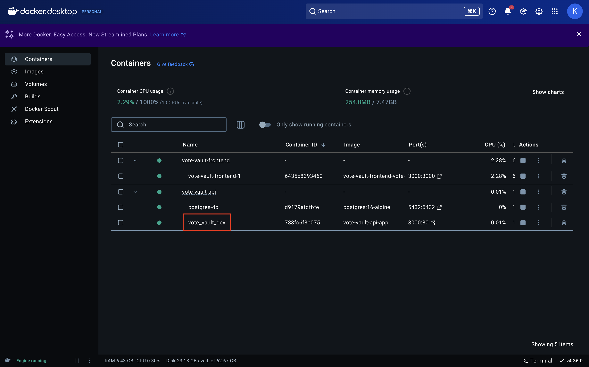
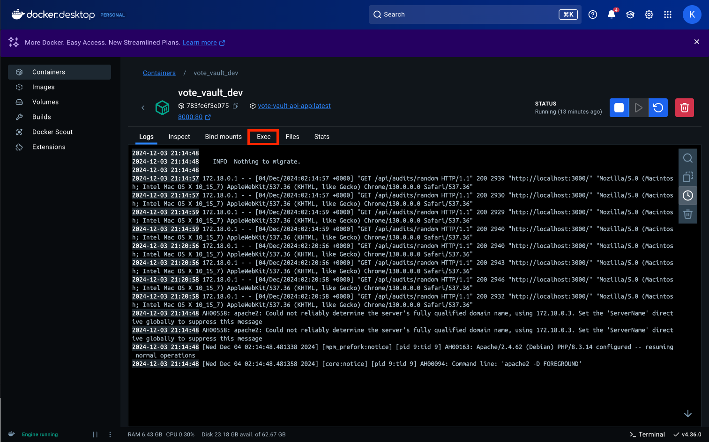
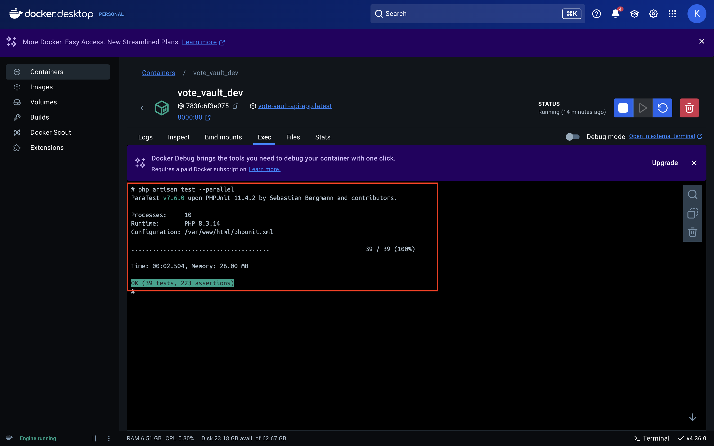

# Vote Vault API

This project used php with Laravel 11 & PostgreSQL 16, see below instructions to replicate a local environment for testing.

## Install Prerequisites

### Install Docker Desktop
- Install Docker Desktop on your machine from this [documentation](https://docs.docker.com/get-started/get-docker/) or the link below.
    - [Mac](https://docs.docker.com/desktop/install/mac-install/)
    - [Windows](https://docs.docker.com/desktop/install/windows-install/)
    - [Linux](https://docs.docker.com/desktop/install/linux/)

### Setup
- Open the Docker Desktop app before the next stage 

## Start the Project Locally
### Start ```vote-vault-api```
Make sure you're in the ```vote-vault-api``` directory, start the docker container for the api
- Only run the command below on the first time you run the docker container or if you made any changes
    ```
    docker compose up --build
    ```

- Run the command below to stop the container
    ```
    docker compose down
    ```
  
- Run this to restart (unless you made changes)
    ```
    docker compose up 
    ```
Go to your browser and enter this link: [http://127.0.0.1:8000/](http://127.0.0.1:8000/), you should see a default Laravel page 

## API End Points
```
{base_URL}/api/vendors
{base_URL}/api/certifications
{base_URL}/api/components
{base_URL}/api/counties
{base_URL}/api/contracts
{base_URL}/api/expenses
{base_URL}/api/inventory_units
{base_URL}/api/storage_locations
{base_URL}/api/dispositions
```
## Testing
We're using phpunit test for this project which is located under the tests folder
- To run the existing tests open docker desktop and click on ```vote_vault_dev``` 
- Select the Exec tab to open terminal of the image 
- Run the following command
    ```
    php artisan test --parallel
    ```
- You should see if they passed or not 

## Common Errors
### Error 1: Connection to server at "postgresql" failed: connection refused
- Sometimes ```vote_vault_dev``` image finish before ```postgres-db``` image which will throw the error like below when you ran ```docker compose up --build``` in ```vote-vault-api``` folder. 
- **Solution 1:** Go to docker decktop and find your ```vote-vault-api``` container and start the ```vote_vault_dev``` image again by clicking the highlighted play button 
- **Solution 2:** sometime your local port at ```5432``` is taken so the container couldn't use the port to connect to the PostgreSQL database, run the following command (or equivalent on window) to check if the port is currently in use
- In your terminal, do this to see if it's in used
  ```
  sudo lsof -i :5432
  ```
  
- Kill all the processes that are running under this port
  ```
  sudo kill -9 <pid>
  ```
- Run the command again to verify no process is running now
  ```
  sudo lsof -i :5432
  ```
